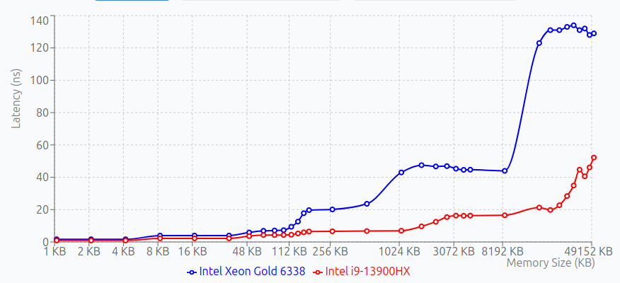

```shell
cmake .. -DBENCHMARK_ENABLE_GTEST_TESTS=OFF -DCMAKE_BUILD_TYPE=Release && cmake --build . && ./bench_list

sudo perf stat -B -e L1-dcache-loads,L1-dcache-load-misses,L1-dcache-stores,L1-dcache-store-misses,l2_request.all,l2_request.miss,LLC-loads,LLC-load-misses,cache-references,cache-misses,dTLB-loads,dTLB-load-misses,dTLB-stores,dTLB-store-misses,dtlb_load_misses.walk_completed,dtlb_store_misses.walk_completed,itlb_misses.miss_caused_walk,dtlb_load_misses.stlb_hit,dtlb_load_misses.walk_completed,dtlb_load_misses.walk_completed_4k,dtlb_store_misses.stlb_hit -r 1 ./bench_list
```

## CPU

* Intel® Xeon® Gold 6338
* https://www.intel.com/content/www/us/en/products/sku/212285/intel-xeon-gold-6338-processor-48m-cache-2-00-ghz/specifications.html


### TLDR;



### Intel® Xeon® Gold 6338

```shell
Run on (8 X 2000 MHz CPU s)
CPU Caches:
  L1 Data 32 KiB (x8)
  L1 Instruction 32 KiB (x8)
  L2 Unified 4096 KiB (x4)
  L3 Unified 16384 KiB (x1)
Load Average: 0.08, 0.02, 0.03
------------------------------------------------------------------------------------------
Benchmark                                Time             CPU   Iterations UserCounters...
------------------------------------------------------------------------------------------
MemoryLatencyList/size KB:1           1.67 ns         1.67 ns    417333248 Nodes=16
MemoryLatencyList/size KB:2           1.67 ns         1.67 ns    416284672 Nodes=32
MemoryLatencyList/size KB:4           1.65 ns         1.65 ns    422576128 Nodes=64
MemoryLatencyList/size KB:8           3.93 ns         3.93 ns    178257920 Nodes=128
MemoryLatencyList/size KB:16          3.97 ns         3.96 ns    177209344 Nodes=256
MemoryLatencyList/size KB:32          3.96 ns         3.96 ns    178257920 Nodes=512
MemoryLatencyList/size KB:48          5.88 ns         5.87 ns    119537664 Nodes=768
MemoryLatencyList/size KB:64          6.90 ns         6.90 ns    101711872 Nodes=1Ki
MemoryLatencyList/size KB:80          7.09 ns         7.09 ns    101711872 Nodes=1.25Ki
MemoryLatencyList/size KB:96          7.29 ns         7.29 ns     84934656 Nodes=1.5Ki
MemoryLatencyList/size KB:112         9.39 ns         9.39 ns     71303168 Nodes=1.75Ki
MemoryLatencyList/size KB:128         12.6 ns         12.6 ns     53477376 Nodes=2Ki
MemoryLatencyList/size KB:144         17.8 ns         17.8 ns     38797312 Nodes=2.25Ki
MemoryLatencyList/size KB:160         19.7 ns         19.7 ns     34603008 Nodes=2.5Ki
MemoryLatencyList/size KB:256         20.1 ns         20.1 ns     34603008 Nodes=4Ki
MemoryLatencyList/size KB:512         23.6 ns         23.6 ns     30408704 Nodes=8Ki
MemoryLatencyList/size KB:1024        43.0 ns         43.0 ns     16777216 Nodes=16Ki
MemoryLatencyList/size KB:1024        42.9 ns         42.9 ns     16777216 Nodes=16Ki
MemoryLatencyList/size KB:1536        47.5 ns         47.5 ns     14680064 Nodes=24Ki
MemoryLatencyList/size KB:2048        46.7 ns         46.7 ns     14680064 Nodes=32Ki
MemoryLatencyList/size KB:2560        46.9 ns         46.9 ns     15728640 Nodes=40Ki
MemoryLatencyList/size KB:3072        45.3 ns         45.3 ns     14680064 Nodes=48Ki
MemoryLatencyList/size KB:3584        44.6 ns         44.6 ns     15728640 Nodes=56Ki
MemoryLatencyList/size KB:4096        44.7 ns         44.7 ns     15728640 Nodes=64Ki
MemoryLatencyList/size KB:4096        44.4 ns         44.4 ns     14680064 Nodes=64Ki
MemoryLatencyList/size KB:8192        44.0 ns         44.0 ns     16777216 Nodes=128Ki
MemoryLatencyList/size KB:16384        123 ns          123 ns      6291456 Nodes=256Ki
MemoryLatencyList/size KB:20480        131 ns          131 ns      6291456 Nodes=320Ki
MemoryLatencyList/size KB:24576        131 ns          131 ns      6291456 Nodes=384Ki
MemoryLatencyList/size KB:28672        133 ns          133 ns      6291456 Nodes=448Ki
MemoryLatencyList/size KB:32768        134 ns          134 ns      6291456 Nodes=512Ki
MemoryLatencyList/size KB:36864        131 ns          131 ns      6291456 Nodes=576Ki
MemoryLatencyList/size KB:40960        132 ns          132 ns      5242880 Nodes=640Ki
MemoryLatencyList/size KB:45056        128 ns          128 ns      6291456 Nodes=704Ki
MemoryLatencyList/size KB:49152        129 ns          129 ns      6291456 Nodes=768Ki
```

### 13th Gen Intel(R) Core(TM) i9-13900HX
```shell
Run on (32 X 600 MHz CPU s)
CPU Caches:
  L1 Data 48 KiB (x16)
  L1 Instruction 32 KiB (x16)
  L2 Unified 2048 KiB (x16)
  L3 Unified 36864 KiB (x1)
Load Average: 0.57, 0.42, 0.41
------------------------------------------------------------------------------------------
Benchmark                                Time             CPU   Iterations UserCounters...
------------------------------------------------------------------------------------------
MemoryLatencyList/size KB:1          0.930 ns        0.930 ns    749731840 Nodes=16
MemoryLatencyList/size KB:2          0.931 ns        0.931 ns    752877568 Nodes=32
MemoryLatencyList/size KB:4          0.931 ns        0.931 ns    751828992 Nodes=64
MemoryLatencyList/size KB:8           2.23 ns         2.23 ns    314572800 Nodes=128
MemoryLatencyList/size KB:16          2.23 ns         2.23 ns    314572800 Nodes=256
MemoryLatencyList/size KB:32          2.23 ns         2.23 ns    314572800 Nodes=512
MemoryLatencyList/size KB:48          3.59 ns         3.59 ns    195035136 Nodes=768
MemoryLatencyList/size KB:64          4.28 ns         4.28 ns    163577856 Nodes=1Ki
MemoryLatencyList/size KB:80          4.28 ns         4.28 ns    164626432 Nodes=1.25Ki
MemoryLatencyList/size KB:96          4.29 ns         4.29 ns    162529280 Nodes=1.5Ki
MemoryLatencyList/size KB:112         4.48 ns         4.48 ns    155189248 Nodes=1.75Ki
MemoryLatencyList/size KB:128         5.25 ns         5.25 ns    131072000 Nodes=2Ki
MemoryLatencyList/size KB:144         5.97 ns         5.97 ns    118489088 Nodes=2.25Ki
MemoryLatencyList/size KB:160         6.49 ns         6.49 ns    105906176 Nodes=2.5Ki
MemoryLatencyList/size KB:256         6.61 ns         6.61 ns    106954752 Nodes=4Ki
MemoryLatencyList/size KB:512         6.75 ns         6.75 ns    104857600 Nodes=8Ki
MemoryLatencyList/size KB:1024        6.93 ns         6.93 ns    100663296 Nodes=16Ki
MemoryLatencyList/size KB:1024        6.93 ns         6.92 ns    102760448 Nodes=16Ki
MemoryLatencyList/size KB:1536        9.63 ns         9.63 ns     61865984 Nodes=24Ki
MemoryLatencyList/size KB:2048        12.5 ns         12.5 ns     56623104 Nodes=32Ki
MemoryLatencyList/size KB:2560        15.4 ns         15.4 ns     46137344 Nodes=40Ki
MemoryLatencyList/size KB:3072        16.3 ns         16.3 ns     42991616 Nodes=48Ki
MemoryLatencyList/size KB:3584        16.2 ns         16.2 ns     44040192 Nodes=56Ki
MemoryLatencyList/size KB:4096        16.3 ns         16.3 ns     42991616 Nodes=64Ki
MemoryLatencyList/size KB:4096        16.3 ns         16.3 ns     42991616 Nodes=64Ki
MemoryLatencyList/size KB:8192        16.5 ns         16.5 ns     41943040 Nodes=128Ki
MemoryLatencyList/size KB:16384       21.3 ns         21.3 ns     38797312 Nodes=256Ki
MemoryLatencyList/size KB:20480       19.8 ns         19.8 ns     34603008 Nodes=320Ki
MemoryLatencyList/size KB:24576       22.7 ns         22.7 ns     29360128 Nodes=384Ki
MemoryLatencyList/size KB:28672       28.4 ns         28.4 ns     23068672 Nodes=448Ki
MemoryLatencyList/size KB:32768       34.9 ns         34.8 ns     18874368 Nodes=512Ki
MemoryLatencyList/size KB:36864       44.7 ns         44.7 ns     17825792 Nodes=576Ki
MemoryLatencyList/size KB:40960       40.6 ns         40.6 ns     15728640 Nodes=640Ki
MemoryLatencyList/size KB:45056       46.1 ns         46.1 ns     15728640 Nodes=704Ki
MemoryLatencyList/size KB:49152       52.2 ns         52.2 ns     10485760 Nodes=768Ki
```